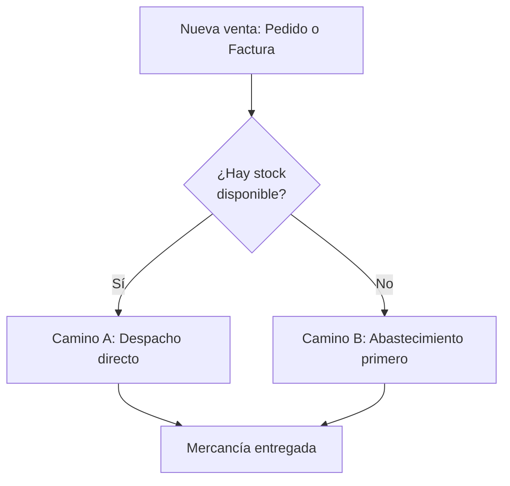
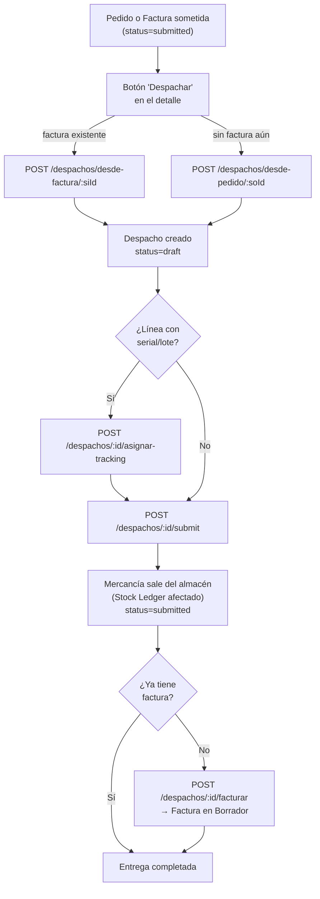
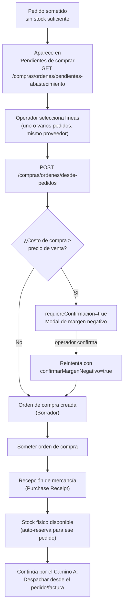
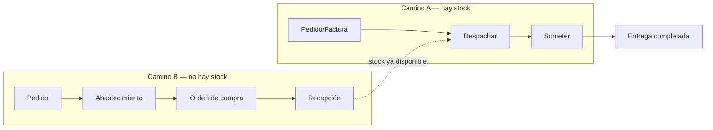

# Flujo completo de venta con Despacho — con y sin mercancía en inventario

> Guía de referencia funcional del módulo Despacho/Reservas/Abastecimiento, escrita a partir de
> la implementación y las pruebas end-to-end realizadas contra un tenant real (`jbc`). Complementa
> a `docs/tasks/PROMPT_DESPACHO_RESERVAS_ABASTECIMIENTO_FRONTEND.md` (que es la especificación
> técnica endpoint por endpoint) con la vista de **flujo de negocio**: qué camino sigue una venta
> según haya o no stock físico disponible al momento de venderla.

Todo lo que sigue asume que el tenant tiene el interruptor `despachoHabilitado` **activado**
(Configuración → Despacho). Con el flag apagado no existe ninguno de estos pasos: la factura
descuenta inventario directamente al someterse, como siempre.

---

## 1. Los dos caminos posibles

Cuando llega una venta, la pregunta que determina el camino es siempre la misma: **¿hay stock
físico disponible (`disponibleParaVender`) para cubrirla ahora mismo?**

- **Camino A — con mercancía en inventario**: se despacha directo contra el pedido o la factura.
  Es el caso más común.
- **Camino B — sin mercancía en inventario**: el pedido queda "pendiente de comprar", entra a la
  cola de Abastecimiento, se genera una orden de compra al proveedor, se recibe la mercancía, y
  **recién ahí** se puede despachar — en ese punto el flujo se une con el Camino A.

---

## 2. Camino A — Venta con mercancía en inventario

### 2.1 Diagrama

### 2.2 Paso a paso

| # | Paso | Endpoint | Quién dispara | Notas |
|---|---|---|---|---|
| 1 | Pedido o Factura sometida | (ya existente) | Ventas | Punto de partida. Si ya hay factura, preferí siempre despachar desde la factura, no desde el pedido. |
| 2 | Crear despacho | `POST /despachos/desde-factura/:siId` **o** `POST /despachos/desde-pedido/:soId` | Botón "Despachar" en el detalle de la factura/pedido | Trae automáticamente todas las líneas pendientes (`qty - delivered_qty`). Queda en **Borrador**, nunca se somete solo. |
| 3 | Asignar serial/lote (solo si aplica) | `POST /despachos/:id/asignar-tracking` | Modal de tracking en el detalle del despacho | Obligatorio antes de someter si alguna línea es artículo serializado/loteado. Sin esto, el submit falla. |
| 4 | Someter el despacho | `POST /despachos/:id/submit` | Botón "Someter" | **Acá ocurre la salida física real de inventario.** Puede fallar por stock insuficiente o por reserva de otro cliente (ver §4). |
| 5 | Facturar (si no había factura) | `POST /despachos/:id/facturar` | Botón "Facturar" en el detalle del despacho | Solo si el despacho nació `desde-pedido` sin factura previa. Devuelve una factura en Borrador; el NCF/e-CF se asigna al someterla, como cualquier factura. |

### 2.3 Variante: venta mostrador sin pedido previo

Cuando no hay pedido ni factura de por medio (venta directa en mostrador con entrega inmediata),
el despacho se crea a mano desde la pantalla de listado de Despachos → "Nuevo despacho"
(`POST /despachos` con el body completo: cliente, sucursal, líneas). El resto del flujo (pasos 3
a 5) es idéntico.

### 2.4 Entregas parciales

Si al momento de despachar no hay suficiente stock para cubrir **todo** lo pendiente de la
factura/pedido, se edita el despacho en Borrador (`PUT /despachos/:id`) bajando las cantidades a
lo que realmente se puede entregar hoy. El resto queda pendiente — al volver a generar un despacho
`desde-factura`/`desde-pedido` sobre el mismo documento, el servidor trae únicamente lo que aún no
se despachó.

---

## 3. Camino B — Venta sin mercancía en inventario (requiere Abastecimiento)

### 3.1 Diagrama

### 3.2 Paso a paso

| # | Paso | Endpoint | Quién dispara | Notas |
|---|---|---|---|---|
| 1 | El pedido queda sin cubrir | (automático) | — | Un pedido sometido con líneas sin stock suficiente aparece solo en la cola de pendientes; no hace falta ninguna acción manual para que "entre" a Abastecimiento. |
| 2 | Ver cola de pendientes de comprar | `GET /compras/ordenes/pendientes-abastecimiento` | Pantalla "Abastecimiento" | Viene ordenado FIFO por fecha del pedido (el más antiguo primero) — no reordenar. Selección múltiple por checkbox. |
| 3 | Seleccionar líneas y elegir proveedor | — | Modal "Generar orden de compra" | Se pueden combinar líneas de **varios pedidos distintos** del mismo artículo en una sola orden — cada línea de la orden resultante queda vinculada a su pedido de origen. |
| 4 | Generar la orden | `POST /compras/ordenes/desde-pedidos` | Botón "Generar orden" | No se manda cantidad: el servidor toma automáticamente todo el pendiente de cada línea al momento de la llamada. |
| 5 | Confirmar margen negativo (si aplica) | mismo endpoint, `confirmarMargenNegativo: true` | Modal de advertencia | Si comprar cuesta igual o más que el precio al que se le vendió al cliente, el primer intento **no crea la orden** — solo devuelve las líneas en rojo para que el operador decida conscientemente. |
| 6 | Someter y recibir la orden de compra | (flujo estándar de Compras, sin cambios) | Pantalla de Órdenes de Compra / Recepción | Al recibir, ERPNext reserva automáticamente ese stock para el pedido de origen (por eso la trazabilidad pedido↔línea de compra del paso 3 importa). |
| 7 | Despachar | — | — | Con stock ya disponible, el pedido/factura sigue exactamente el **Camino A** (§2) desde el paso 2 en adelante. |

### 3.3 Por qué importa la trazabilidad pedido↔línea

Cada línea de la orden de compra generada en el paso 4 recuerda de qué `Sales Order` vino. Esto
es lo que le permite a ERPNext, al recibir la mercancía, reservarla automáticamente para ese
pedido específico (`Stock Reservation Entry`) en vez de dejarla como stock libre que cualquier
otra venta podría tomar primero. Es también la razón por la que **Transferencias** ahora valida
que no se mueva stock reservado de esta forma (§6.1 del prompt técnico) — moverlo rompería esa
promesa implícita al cliente que generó la compra.

---

## 4. Reglas de negocio que cruzan ambos caminos

### 4.1 Cancelación — la asimetría es intencional, no un bug

La factura y el despacho son documentos de inventario independientes una vez que despacho está
activo. Cancelar puede dejar huérfano al otro documento **solo en un sentido**:

| Situación | ¿Se permite cancelar? | Por qué |
|---|---|---|
| Cancelar un **despacho** que ya fue facturado vía "Facturar" (§2.2 paso 5) mientras esa factura sigue viva | ❌ Bloqueado (400) | El despacho es el documento "dependiente" de esa factura nueva — cancelarlo dejaría la factura sin respaldo de inventario. |
| Cancelar una **factura** que generó un despacho vía `desde-factura` (§2.2 paso 2), aunque ese despacho siga sometido | ✅ Permitido | Acá el despacho es el "raíz" (nació primero, contiene el movimiento físico real); la factura es la dependiente. Cancelarla es la forma correcta de deshacer un error de facturación después de haber despachado ya. |
| Cancelar un **despacho** creado `desde-factura` mientras la factura de origen sigue viva | ✅ Permitido | Mismo caso que arriba, visto desde el despacho: es el documento raíz, no depende de la factura para ser válido. |

**No se debe replicar esta lógica en el frontend** — el botón "Cancelar" se muestra siempre que
`status === "submitted"`, y el servidor decide caso por caso. La primera versión de esta
validación bloqueaba ambos sentidos simétricamente y producía un deadlock real (ninguno de los
dos documentos podía cancelarse); quedó corregida deliberadamente de forma asimétrica.

### 4.2 Devolución — el despacho no es el camino si ya hay factura

`POST /despachos/:id/devolucion` solo completa la devolución si el despacho **no** tiene factura
sometida encima. Si ya fue facturado, el servidor rechaza con 400 y el frontend debe **redirigir**
a la pantalla de Devoluciones (`/devoluciones/nueva?invoiceId=...`) — ese es el único camino que
emite la Nota de Crédito fiscal (NCF tipo B04). Devolver por el lado del despacho sin factura
reingresa stock pero no toca el saldo del cliente ni el comprobante fiscal.

### 4.3 Reservas de stock protegen contra pisar ventas de otro cliente

Tanto en Camino A (someter un despacho) como al transferir stock entre almacenes, ERPNext valida
que no se toque mercancía con `Stock Reservation Entry` de otro pedido. El campo
`disponibleParaVender` (`actualQty - reservedStock`) en Inventario es el número confiable de
"cuánto hay realmente para prometerle a un cliente nuevo" — no `actualQty` a secas.

---

## 5. Evidencia de pruebas end-to-end (tenant `jbc`)

Flujo verificado en vivo contra el backend real:

- **Camino A completo**: factura `ACC-SINV-2026-00017` → despacho `MAT-DN-2026-00004`
  (`desde-factura`) → sometido → intento de devolución rechazado con 400 → redirección a
  Devoluciones con `invoiceId` precargado correctamente.
- **Camino A, variante directa**: despacho `MAT-DN-2026-00003` creado sin pedido, editado,
  sometido y facturado (`POST /despachos/:id/facturar`) → factura `ACC-SINV-2026-00085` generada
  en Borrador.
- **Camino B completo**: pedido `SAL-ORD-2026-00001` (artículo `E2E-TEST-001`) apareció en
  "Pendientes de comprar" → seleccionado junto con proveedor "altice" → orden de compra
  `PUR-ORD-2026-00002` generada exitosamente vía `POST /compras/ordenes/desde-pedidos`.
- **Cancelación asimétrica**: despacho `MAT-DN-2026-00004` (nacido `desde-factura`) cancelado
  exitosamente mientras la factura `ACC-SINV-2026-00017` seguía `submitted`/pagada — confirmado
  como comportamiento intencional, no bug (§4.1).

---

## 6. Resumen visual — los dos caminos convergiendo

